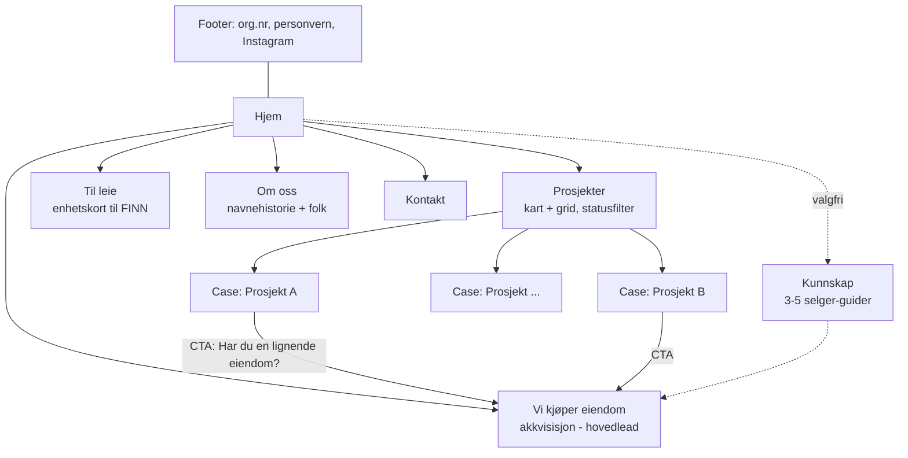

# Nettside for MCTY Eiendom — researchrapport og anbefaling

**Dato:** 10. august 2026 · **Bestilt av:** Erlend · *Utarbeidet med Claude*

---

**Om metoden (leses én gang):** Direktehenting av nettsider var blokkert av nettverkspolicyen i researchmiljøet. Alle funn om eksterne nettsider er derfor verifisert via søkeindeksert innhold (sideinnhold gjengitt i søkeresultater, Awwwards-oppføringer, byråers case-studier) — URL-ene er reelle og funnet i søk, ingen er gjettet, men ingen av sidene er visuelt inspisert. De viktigste referansene bør åpnes manuelt (med skjermbilder) før designarbeidet starter. Det samme forbeholdet gjelder MCTY-funnene: alt som ikke er merket «bekreftet» må verifiseres, se kapittel 2. Kildehenvisninger står fortløpende i teksten og samlet i kapittel 17.

---

## 1. Executive summary

1. **MCTY er i praksis digitalt usynlig i dag** — ingen nettside, ingen indeksert Instagram-profil, ingen presseomtale, ingen Proff-side lot seg finne. Nettsiden blir selskapets primære troverdighetsflate, og den bygger synligheten fra null. Det er en fordel: søkebildet for «MCTY eiendom» i Norge er tomt og kan eies raskt.
2. **Firmagrunnlaget er uverifisert.** Det finnes en sterk indikasjon (ikke bekreftet) på at selskapet heter «MCTY EIENDOM AS», nystiftet 2025/26 via hylleselskap. Org.nr, roller, eiere og prosjekthistorikk er ukjent. Ett brreg-oppslag og en samtale med svigerinnen gir fasit — dette må skje før noe publiseres (kapittel 2).
3. **Nøkkelfunn om inspirasjonssidene: ingen av de fire bruker 3D/WebGL.** Cole West, Marshall White, Base Habitation og Luxury Places bæres alle av fotokvalitet, video, parallax, ro og typografi — ikke av 3D-teknologi. Appellen Erlend har registrert kan altså kjøpes for foto- og designbudsjett, ikke WebGL-budsjett (kapittel 4 og 9).
4. **Anbefalt sjanger er boutique-utvikleren, ikke megleren.** Forsiden er et kuratert prosjektgalleri; hver prosjektside er en case med faktaboks og konkret fortelling (Fortis-/Neometro-modellen). Meglersidenes IA med søk og tusenvis av objekter gir en tom og død side for et firma med en håndfull prosjekter — skala-fellen må unngås (kapittel 3–4).
5. **Før/etter-caser er et reelt hull i det norske markedet.** Nesten ingen norske utviklere eller flippere viser transformasjonen systematisk. En gjennomarbeidet case-mal med før/etter-slider, nøkkeltall og prosessfortelling blir MCTYs signaturinnhold og differensiator (kapittel 7).
6. **Akkvisisjonssiden «Vi kjøper din tomt eller bolig» er den viktigste lead-siden** og skal ligge som eget toppnivåpunkt i menyen. Norsk mønster: konkrete kjøpskriterier, 3-stegs prosess, navngitt person med bilde, «uforpliktende vurdering» — og et eksplisitt svar på off-market-skepsisen som norsk presse (NRK, DN, Dinside) har skapt (kapittel 8).
7. **Merkevarehistorien er uvanlig sterk:** MCTY = McIntyre, uttalt «mektig» på norsk, og McIntyre kommer fra gælisk «Mac an t-Saoir» — «tømrerens sønn». For et firma som lever av håndverk og transformasjon er dette en posisjoneringsgave: «tømrerens etterkommere» + nøktern, tallbasert tone, ikke luksusretorikk (kapittel 5).
8. **3D-budsjettet spisses etter stigen i kapittel 9:** trinn 1 (GSAP scroll-motion og før/etter-slidere, i praksis gratis verktøy) og trinn 2 (Matterport/360 per ferdig enhet, estimert 3 000–10 000 kr per objekt) nå; trinn 3 (scroll-scrubbet drone-/rendersekvens) kun på flaggskip-case; full WebGL (trinn 5, estimert 300 000 kr+) utsettes.
9. **Foto foran alt annet i budsjettet:** «før»-bilder kan aldri tas i etterkant. Innfør en fast rutine — dokumentér alt ved overtakelse — og bestill profesjonell foto/drone/twilight ved ferdigstillelse (estimert 2 500–6 000 kr per oppdrag + 1 500–3 000 kr drone; innhent lokale tilbud).
10. **Jus setter rammer designet må ta hensyn til:** WCAG 2.0 AA er lovpålagt også for et lite AS (slider, 3D og lavkontrast-palett påvirkes), ny ekomlov (2025) krever aktivt cookie-samtykke — cookiefri analyse anbefales — og alle renders må merkes «Illustrasjon» etter Forbrukertilsynets boligmarkedsføringsregler (kapittel 12).
11. **Teknisk anbefaling:** prosjekter som strukturert innholdstype i et CMS svigerinnen kan betjene selv — hovedanbefaling Webflow/Framer (raskest til mål) eller Sanity + Astro/Next (mest fremtidssikker), med kravet «nytt prosjekt publisert på under 30 minutter» som styrende kriterium (kapittel 13).
12. **Handling nå, uavhengig av design:** verifiser org.nr hos Brønnøysund, bekreft og registrer mcty.no + mctyeiendom.no hos Norid-registrar (fremstår ledige via DNS, ubekreftet), sett opp e-post på eget domene med SPF/DKIM/DMARC, og opprett Google Business Profile og LinkedIn ved lansering.

---

## 2. Om MCTY — bekreftet, indikasjon og ukjent

Kilde for hele kapitlet: MCTY-researchen (firma-, Instagram- og domenesporet). Skillet under er bevisst knallhardt — ingenting fra kolonnen «indikasjon» eller «ukjent» skal publiseres på nettsiden før det er verifisert.

### 2.1 Bekreftet (verifiserbare, primært negative funn)

- **Ingen eksisterende nettside:** mcty.no, mctyeiendom.no og mctyeiendom.com er ikke delegert i DNS (autoritativt NXDOMAIN mot Google Public DNS, kryssjekket med kontrolldomener). mcty.com og mcty.net **er** registrert av ukjente tredjeparter; mcty.com har AWS-navneservere og aktive A-records, men ingen MX-records (ingen e-postbruk) og ingen identifiserbar virksomhet i søk.
- **Ingen søkesynlighet:** søket «mctyeiendom» gir null indekserte treff. Instagram-profilen @mctyeiendom er ikke indeksert og kunne ikke leses fra researchmiljøet — bio, følgertall, prosjekter og personene bak er udokumentert.
- **Navnekollisjoner på «MCTY» er internasjonale og svake:** amerikansk SPAC-ticker (Motor City Acquisition Corp., NASDAQ: MCTY, IPO 2021 — capedge.com/company/1846752/MCTY), en musikkartist på Apple Music/Deezer, klesmerket @mcty_apparel og en USGS-målestasjon. Ingen norske selskaper med «MCTY» i navnet ble funnet, og ingen eiendomsaktører.
- **Norid-reglene:** .no-domene krever norsk org.nr i Enhetsregisteret, registreres via godkjent registrar, førstemann-til-mølla (norid.no; registrarkilder webhuset.no, domene.no).

### 2.2 Indikasjon (sannsynlig, men UBEKREFTET)

- **UBEKREFTET:** Det ser ut til å eksistere et selskap ved navn «MCTY EIENDOM AS». Grunnlag: eksakte frasesøk ga konsistente treff mot purehelp.no-sider i eiernettverket til Nytt Foretak AS (org.nr 914 545 080, Norges største hylleselskap-leverandør — nyttforetak.no/om-oss).
- **UBEKREFTET:** Søkeutdrag antyder at MCTY Eiendom AS står oppført som 100 % eid av Nytt Foretak AS i siste indekserte aksjonærregisterdata — et typisk mønster for et helt ferskt selskap (kjøpt hylleselskap) der reelle eiere ennå ikke er synlige i offentlige data. Registrering trolig 2025/2026.
- **UBEKREFTET og svakt:** Frasen dukker opp på aksjonærnettverk-sidene til Mortensrud Tomt 1 AS (935 900 441) og Aaltvedt Eiendom AS (935 486 580). Det finnes **ingen** holdepunkter for reell forretningsmessig kobling — mest sannsynlig deler de bare formell hylleselskap-eier. Skal ikke omtales noe sted før bekreftet.
- **Domeneledighet:** mcty.no og mctyeiendom.no *fremstår* ledige (NXDOMAIN), men Norid-oppslaget var blokkert — et domene kan i teorien være registrert uten delegering eller ligge i karantene.

### 2.3 Ukjent

Org.nr, registrert navn, stiftelsesdato, adresse/kommune, bransjekode, roller (daglig leder, styre), reelle eiere, eventuell selskapsstruktur (holdingselskap, prosjektselskaper per eiendom — vanlig i bransjen), prosjekthistorikk med adresser/årstall/utfall, og alt innhold på Instagram-profilen.

### 2.4 Verifiser-sjekkliste (før noe publiseres)

1. **Brønnøysund:** søk «MCTY» på virksomhet.brreg.no eller API-et data.brreg.no/enhetsregisteret/api/enheter?navn=MCTY — gir eksakt navn, org.nr, stiftelsesdato, adresse og NACE-kode på under ett minutt.
2. **Svigerinnen:** be om org.nr og registrert juridisk navn (kan avvike fra «MCTY» hvis MCTY kun er markedsføringsnavn), hvem som sitter i rollene, om selskapet ble kjøpt som hylleselskap (registrert stiftelsesdato kan da være eldre enn reell oppstart — relevant for «om oss»-tekst), og om det finnes/planlegges egne prosjektselskaper per eiendom (avgjør om nettsiden bygges som paraplymerke).
3. **Norid:** bekreft ledighet på norid.no/domeneoppslag (eller en registrar som Domeneshop) for mcty.no og mctyeiendom.no — registrer begge på selskapets org.nr straks det foreligger (~100–200 kr/år per domene).
4. **Instagram:** bekreft eksakt stavemåte av handelen, og gå gjennom profilen manuelt med sjekklisten i vedlegg A.
5. **Patentstyret:** raskt varemerkesøk på «MCTY» (search.patentstyret.no) — lav risiko, men billig forsikring.
6. **Prosjektliste:** skriftlig godkjenning fra firmaet på hvilke prosjekter, adresser og tall som kan publiseres offentlig.

---

## 3. Landskapet: tre sjangre — og norsk standard vs. det som utmerker seg

Researchen på tvers av syv temaspor identifiserte tre tydelige sjangre. MCTY trenger elementer fra alle tre, men hovedmodellen er den første.

**Sjanger 1 — boutique-/design-utvikleren.** Rolige, prosjekt-første nettsider der forsiden i praksis er et kuratert prosjektgalleri, hver prosjektside er en case med fakta og konkret fortelling, og tillit bygges med tall, navngitte samarbeidspartnere og ekte mennesker. Flere driver lettvekts redaksjonelt innhold (Neometros Open Journal siden 2013). Tonen er lavmælt: kvalitet formidles via foto, typografi og tall, ikke adjektiver.

**Sjanger 2 — enkeltprosjekt-microsites og immersive opplevelser.** Når ett stort prosjekt skal selges tungt får det egen påkostet site (onedelisle.com, 111w57.com), gjerne med WebGL/motion (Hubtown vant Awwwards Site of the Day juni 2026). Mønsteret hos de beste: 3D legges på flaggskip og kampanjer — aldri på hele hovedsiden. Ifølge digitalstrategyforce.com vinner immersive 3D-opplevelser 61 % av Awwwards SOTD i Q1 2026, med arkitektur/eiendom som stor kategori — men dette er byråbudsjett-territorium.

**Sjanger 3 — akkvisisjonssiden.** Et eget designspråk: skjema-først, 3-stegs prosess, ærlige vilkår (Opendoor er referansen), eller minimumsvarianten «Land Wanted»-side med kriterier + skjema (Modbox). Ingen av de beste blander denne inn i prosjektfortellingen — den ligger som egen, tydelig inngang i hovedmenyen.

**Norsk standard:** Sitemap-en er påfallende smal og lik hos alle — Hjem, Prosjekter (statusdrevet: kommer for salg / til salgs / ferdigstilt), Om oss, Aktuelt, Kontakt, Personvern. Besøkende er trent på mønsteret av Selvaag/OBOS/Solon; avvik skaper friksjon, ikke særpreg. Det som skiller de beste fra de kjedelige i Norge: (1) konkrete tall og mennesker fremfor generisk tekst, (2) statusdrevne prosjektsider som viser at ting skjer, (3) tydelig identitet (Union: lokalpatriotisme for Drammen; Solon: designprofil), (4) tredjepartsbevis. **To hull i det norske markedet:** dedikerte akkvisisjonssider er underutnyttet, og nesten ingen viser systematiske før/etter-caser — begge kan MCTY eie.

### De beste eksemplene (utvalg på tvers av alle spor)

| # | Aktør | URL | Hvorfor relevant |
|---|-------|-----|------------------|
| 1 | Fortis (AU) | fortis.com.au | Den mest relevante boutique-malen; Pallas House-casen (kjøpesum, 90 % gjenbruk, pris vunnet) er fasiten for case-detaljnivå. |
| 2 | Neometro (AU) | neometro.com.au | Design-ledet utvikler med eget magasin — innhold + design gir troverdighet uten hype. |
| 3 | Milieu (AU) | milieuproperty.com.au | Manifest («development is a creative act») og navngitte samarbeidspartnere som tillitsvaluta. |
| 4 | Alloy (US) | alloyllc.com | «Vi gjør alt selv»-fortellingen; team med ekte mennesker som designmål. |
| 5 | DDG (US) | ddgpartners.com | Porteføljesider med håndverks-/materialfortelling — craft fremfor salg. |
| 6 | Hubtown (IN) | hubtown.co.in | 3D-referansen (Awwwards SOTD juni 2026, Three.js + GSAP) — kun relevant ved stort budsjett. |
| 7 | One Delisle (CA) | onedelisle.com | Malen for enkeltprosjekt-microsite: hovedsiden holdes rolig, flaggskipet får egen site. |
| 8 | 111 West 57th (US) | 111w57.com | Hvor langt «vis, ikke fortell» kan dras — foto/film og få tall bærer alt. |
| 9 | Opendoor (US) | opendoor.com | Gullstandard for akkvisisjons-UX: adresse først, 3 steg, eksplisitt friksjonsfjerning. |
| 10 | Haga Bolig (Stavanger) | hagabolig.no | Beste norske forbilde i riktig størrelse: statusdrevet pipeline, navngitte personer per målgruppe. |
| 11 | Solon Eiendom | soloneiendom.no | Norsk designbenchmark (byrået DAYTWO); nøkkelfakta-standarden på prosjektsider. |
| 12 | Solid Gruppen | solid.no/selskapet/vi-kjoper-tomter | Kriterie-tydelighet: tomter for 6+ enheter, definert geografi, partnerskapsmodell. |
| 13 | Base Gruppen | basegruppen.no/vi-kjoper-og-utvikler-tomter/ | Beste norske akkvisisjonsargumentasjon: «hva kan eiendommen være verdt etter utvikling», kjøp/opsjon/samarbeid. |
| 14 | Regalis Eiendom | regaliseiendom.no/tomt/ | Liten Oslo-utvikler med dedikert «Tomt ønskes kjøpt»-side — friksjonssenkende copy. |
| 15 | Opsahl Gruppen | opsahlgruppen.no/bolig/selge-eiendom-til-utbygger/ | Beste akkvisisjonsside funnet: gratis befaring, svarer på selgers reelle spørsmål. |
| 16 | BoNo Bolig (Bergen) | bonobolig.no/vi-kjoper-tomter-for-utvikling | Konkrete kriterier + 50/50-partnerskapsmodell + tredjepartsbevis (kundetilfredshetskåring). |
| 17 | Union Eiendomsutvikling | unioneiendom.no | Lokal identitet som tillitsstrategi («brenner for Drammen»). |
| 18 | Birk & Co | birkco.no | To gründere, etablert 2015 — personene bærer tilliten; konseptnavn per prosjekt. |
| 19 | Vervet (Tromsø) | vervet.no/boligvelger/3d | Norsk 3D-konvensjon: boligvelgeren er salgsverktøy, ikke pynt. |
| 20 | Selvsolgt | selvsolgt.com | «Bud innen 24 timer»-modellen for boligkjøp: som den er, valgfri overtakelse, oppgjør via megler/advokat. |

Advarende eksempel: As-Eiendom (as-eiendom.webnode.page) — nøyaktig samme forretningsmodell som MCTY, forbilledlig posisjonering i én setning, men gratis Webnode-side uten prosjektdokumentasjon. Listen blant småaktører ligger lavt; det er lett å skille seg ut med en profesjonell side.

---

## 4. De fire inspirasjonssidene — hva de faktisk er

Deep-divene på Erlends fire inspirasjonssider ga rapportens kanskje viktigste funn: **ingen av dem har dokumentert 3D/WebGL.** Appellen ligger i foto-/videokvalitet, parallax, ro og typografi. I tillegg er tre av fire en annen firmatype enn MCTY — de kan låne bort estetikk og enkeltgrep, men ikke informasjonsarkitektur.

### 4.1 Cole West (cwgroup.com) — vertikalt integrert utvikler, USA

**Hva det er:** Utah-basert utvikler med hele MCTYs verdikjede (tomteakkvisisjon → utvikling → bygging → salg/utleie), men i konsernskala: 50+ aktive prosjekter, 4 000+ enheter. **Appellen:** verdikjeden som fortelling, egen /we-buy-land/-akkvisisjonsside i hovedmenyen, portefølje i både grid- og kartvisning, tillit via historie og tall. **Overførbart:** akkvisisjonsside med kort skjema og hook («Har du en tomt eller bolig med uutnyttet potensial?»), kart + grid-portefølje, talltunge prosjektsider, «omtalt i»-seksjon, proof-bar med kun ekte tall. **Ikke kopiér:** konsernspråket («divisjoner», corporate-fraser) — virker oppblåst for et lite firma; to-domene-oppsettet (cwgroup.com + colewest.com) som skaper målbar forvirring; og «We Buy Land»-retorikken rått oversatt — den lukter kontantoppkjøper i Norge uten org.nr, navngitte personer og ærlig prosess.

### 4.2 Marshall White (marshallwhite.com.au) — prestisjemegler, Melbourne

**Hva det er:** Ikke utvikler, men Melbournes ledende luksusmegler («Pioneers of prestige since 1964»), ni kontorer, hundrevis av meglere, 2024-rebrand av byrået Atollon bygget for å virke «confident, enduring, and quietly authoritative» — redaksjonelt magasinuttrykk med statelig serif, dempet klassisk palett og førsteklasses foto/video. **Appellen:** «stille autoritet»-designspråket, heritage-signaturen, resultatbevis overalt, «confidential property appraisal» som gjennomgående CTA, transparensprinsippet («gi mer informasjon enn besøkende forventer»). **Overførbart:** designspråket, appraisal-CTA-en oversatt til akkvisisjon («uforpliktende, konfidensiell vurdering av tomten/boligen din»), construction-updates-arkivet (perfekt råmateriale-mønster for flipping-dokumentasjon), FAQ per målgruppe, solgt-arkiv som bevispunkt. **Ikke kopiér — skala-fellen:** Marshall White har tusenvis av objekter, søkefunksjon, meglerkatalog og suburb-arkiver. Et lite firma som kopierer denne IA-en får en side som ser **tom** ut — tomme «til salgs»-lister er verre enn ingen. Dropp også prestisjevokabularet («luxury», «prestige») — det bikker over i selvhøytidelighet i norsk SMB-kontekst. Og merk kostnadssiden: uttrykket kollapser uten profesjonelle bilder på hvert objekt.

### 4.3 Base Habitation (basehabitation.com) — prefab-produsent, Québec

**Hva det er:** Ikke utvikler, men et arkitektdrevet produktselskap (grunnlagt 2023, lansert 2026) som selger ett prefab-hussystem, fortsatt i pre-launch. **Appellen:** livsstilsmerke med knivskarp tagline («Let the wild in. Find your Base.»), radikal pris- og prosessåpenhet (fastpris brutt ned, pluss ærlig «ikke inkludert»-liste med estimater), fysisk bevis som konverteringsmotor (Base Camp — et hus man kan overnatte i), produktisering (alt har navn og tall), grunnlegger-fronting. **Overførbart:** tagline-formelen (løfte + handling), «System & Pricing»-siden oversatt til akkvisisjonsprosessen (steg, tidslinje, hvem dekker hva, hva som ikke inngår), produktiserte tilbud («Direktekjøp» / «Utviklingssamarbeid» / «Utleie»), partner-synliggjøring, lettvekts redaksjonelt nav (4–6 eviggrønne artikler, ikke løpende nyhetsbrev). **Ikke kopiér:** manifest-tonen — den treffer feil overfor en norsk tomteselger som lurer på «hva får jeg, hva koster det»; og pre-launch-strukturen — MCTY har (antatt) faktiske prosjekter og skal lede med bevis, ikke visjon.

### 4.4 Luxury Places SA (luxury-places.ch) — luksusmegler, Sveits

**Hva det er:** Sveitsisk megler (siden 2006, Savills-partner) som selger andres eiendommer for CHF 5–30 mill. — kjøper og utvikler ingenting selv. **Appellen (verifisert via Awwwards-oppføringen):** streng monokrom palett (#F0F0F0 + svart) der fotografiet bærer all farge, store fullskjermsbilder, rolig parallax og myke overganger — «wow-følelsen» er GSAP-territorium, ikke WebGL. Deres «3D» er innholdsproduksjon (renders av eiendommer), ikke web-teknologi. **Overførbart:** monokrom-prinsippet (perfekt for før/etter-foto), ett prosjekt om gangen i fullskjerm i stedet for kortgrid, 3D som innhold («slik kan din tomt se ut» på akkvisisjonssiden), harde tillitstall, lånt troverdighet fra partnere, nedlastbar PDF som sekundær-CTA. **Ikke kopiér:** luksusretorikken (fungerer bare fordi tallene deres er sanne), «pris på forespørsel»-mystikken (i Norge senker skjult informasjon tilliten — særlig for et ukjent firma som ber folk selge utenom åpent marked), og to-domene-arkitekturen med objektdatabase på subdomene.

### 4.5 Syntesen

På tvers av de fire: (1) roen, luften og fotokvaliteten er det Erlend faktisk reagerer på — og den er oppnåelig uten 3D; (2) alle fire mangler det MCTY trenger mest — før/etter-fortellingen og en norsk-tilpasset akkvisisjonsmekanikk; (3) skala-fellen er reell — IA-en må bygges for få, dype case, ikke brede lister; (4) ett navn, ett domene (to av fire roter dette til).

---

## 5. Anbefalt konsept for MCTY

### 5.1 Posisjonering: tømrerens etterkommere

Navnehistorien er merkevarens kjerne: MCTY er en forkortelse av etternavnet McIntyre og uttales på norsk «mektig» — et bevisst ordspill. McIntyre kommer fra gælisk «Mac an t-Saoir», «tømrerens sønn». For et firma som kjøper slitte eiendommer og løfter dem med håndverk er dette en posisjoneringsgave: historien kobler navn, familie og fag i én setning, og den er *sann* — i motsetning til innkjøpte «vi skaper verdier»-fraser. Anbefalt bruk: kort fortalt på Om oss (3–4 setninger), antydet i taglinen, aldri overforklart. Forsidens posisjonering holdes konkret etter As-Eiendom/Haga-mønsteret: «Vi kjøper tomter og boliger i [region], utvikler dem og selger eller leier ut.»

Fordi selskapet (trolig) er nystiftet, kan nettsiden ikke bære selskapshistorikk. Tilliten må i stedet hentes fra: personene bak (navn, bilder, bakgrunn — Birk & Co-/Fortis-mønsteret), org.nr og full firmainfo i footer, dokumenterte prosjekter med adresser og årstall (der firmaet godkjenner), og navngitte samarbeidspartnere (håndverkere, takstmann, megler, bank). Formuler erfaring personlig («vi har pusset opp X boliger siden …»), ikke selskapshistorisk.

### 5.2 Tone: nøktern, konkret, tallbasert

Norsk bransjestandard hos seriøse aktører er rolig og talldrevet — årstall, m², antall enheter; taglines på «Vi skaper bedre hjem»-nivå. Superlativer, utropstegn og press er markører for useriøse aktører (jf. «we buy houses»-analysene). MCTYs tone: korte setninger, verbtungt, fakta fremfor adjektiver, britisk-nøktern heller enn amerikansk-selgende. Luksusvokabular droppes helt — «kvalitet» vises i foto og tall, ikke i ord. Konkrete toneeksempler i kapittel 10.3.

### 5.3 Designretning: stille autoritet

Designretningen kobles til de eksisterende logoutkastene (eget leveransedokument): A «Blokken», B «Tømrerens sønn», C «Gavlen» og D «Stille autoritet», med foreslått palett Granitt #211F1C, Kalk #F2F0EA, Skoggrønn #2E5239 og Stein #8A857C. Researchen støtter retningen entydig: både Fortis' dokumenterte «purposefully quiet»-strategi, Marshall Whites «quietly authoritative»-rebrand og Luxury Places' monokrome #F0F0F0/svart peker mot samme oppskrift — **monokrom/nesten-monokrom base der fotografiet bærer all farge**, generøs luft, maks to fontfamilier, og motion i små doser. Kalk som lys base, Granitt som tekst, Skoggrønn som eneste aksent (sparsomt: CTA-er, statusbadges, nøkkeltall) matcher «quiet luxury»-funnene fra design-sporet (varm off-white base, charcoal tekst, én dyp aksent) nesten en-til-en. Merk WCAG-forbeholdet i kapittel 12: lavkontrast-kombinasjoner (Stein på Kalk) må kontrastsjekkes før bruk på tekst.

---

## 6. Anbefalt sidestruktur (IA)

Strukturen følger norsk standard (brukerne er trent på den) med to bevisste tillegg: akkvisisjonssiden som toppnivåpunkt (Solid gjemmer sin under «Selskapet» — en dokumentert svakhet) og «Til leie» som egen status/inngang (MCTY beholder enheter).

| Side | URL | Begrunnelse |
|------|-----|-------------|
| Hjem | / | Hero med foto + én setnings posisjonering → 2–4 ekte nøkkeltall → 3 utvalgte prosjektkort (før/etter) → kort verdikjede-seksjon («kjøper → utvikler → selger/leier ut») → om oss-blokk med ansikter → to likestilte CTA-er: «Se prosjektene» og «Selg til oss». |
| Prosjekter | /prosjekter | Kuratert oversikt med statusfilter (Under arbeid / Til salgs / Til leie / Solgt / Utleid) og kart + grid-visning (Cole West-mønsteret — kartet beviser lokal tilstedeværelse). Solgte/utleide prosjekter blir stående som track record (Gjelsten-mønsteret: arkivet er et eget produkt). |
| Prosjekt/case | /prosjekter/{slug} | Én gjenbrukbar case-mal (kapittel 7). Dette er bevismaterialet som gjør at en tomteselger tør å ta kontakt. |
| Vi kjøper eiendom | /vi-kjoper | Den viktigste lead-siden — eget toppnivåpunkt, avskallet layout, rask lastetid (kapittel 8). |
| Til leie | /til-leie | Enkle enhetskort med lenke til FINN-annonse/kontakt — ingen egen bookingportal. Porteføljen fungerer også som tillitsbevis («vi eier og forvalter det vi bygger»). |
| Om oss | /om-oss | Navnehistorien (McIntyre/«mektig»/tømrerens sønn), personene med navn/bilde/bakgrunn, samarbeidspartnere, org.nr. |
| Kontakt | /kontakt | Navngitte personer per henvendelsestype (Haga-mønsteret: én e-post for kjøp/leie, én for «selge til oss»), adresse, org.nr. |
| Personvern | /personvern | Lovpålagt (GDPR + cookies, kapittel 12). |
| (Aktuelt/kunnskap) | /kunnskap | Valgfri lettvekt: 3–5 eviggrønne selger-guider («Selge tomt til utbygger: slik foregår det» osv., kapittel 11). Ingen nyhetsfeed — et dødt arkiv svekker tillit. Kan utelates i v1. |

Prinsipper: «Vi kjøper»-budskapet gjentas som CTA på forsiden, i footer og nederst på hver case-side — case-sidene er beviset, akkvisisjonssiden er konverteringen. Store salgsprosjekter kan senere skilles ut som microsite (norsk mønster: skogsnar.soloneiendom.no, fyrstikkbakken14.no), men i MCTYs størrelse holder prosjektsider på hoveddomenet. Alt på ett domene og ett navn — lærdommen fra Cole Wests og Luxury Places' fragmenterte oppsett.

---

## 7. Case-sidens anatomi

Case-malen er MCTYs signaturinnhold. Formatet er «mini-case-studie», ikke galleri (Curbio-/Sweeten-/Fortis-mønsteret): situasjon → grep → resultat, med tall der de er godkjent. Samme side skal overbevise to målgrupper samtidig — boligkjøpere/leietakere («de leverer kvalitet») og tomte-/boligselgere («de gjennomfører og betaler riktig»).

### 7.1 Seksjonsmal (rekkefølge på siden)

1. **Hero:** beste «etter»-foto eller kort video, prosjektnavn (kort stedsnavn — konsekvent navngiving à la Cole West/SOLIS), status-badge.
2. **Faktaboks:** sted/bydel, boligtype, hva som ble gjort (totalrenovering/tilbygg/seksjonering/nybygg), kjøpsår → ferdigstilt (varighet), antall enheter, m², status (Solgt / Utleid / Til salgs / Under arbeid), MCTYs rolle. Norsk standardfelt-liste dokumentert hos Solon (Landsnes Hage) og Kvass.
3. **Før/etter-par:** interaktiv draggbar slider som hovedelement — med tastaturbetjening og statisk side-ved-side-fallback (WCAG, kapittel 12). Ferdige komponenter finnes; ikke bygg galleri uten sammenligning.
4. **Prosessfortelling:** 2–3 avsnitt i tre akter — utgangspunkt → grep → resultat. Konkret og ærlig (Sweeten-funnet: budsjett-transparens og ærlighet om det som gikk galt gir mer troverdighet enn glansbilder). Tall kun der firmaet har godkjent publisering.
5. **Galleri:** 4–8 profesjonelle bilder i editorial layout med mye luft — ett stort bilde om gangen, ikke trangt grid.
6. **Kart:** beliggenhet (kartløsning med personvernvurdering, kapittel 12).
7. **Eventuelt:** sitat fra kjøper/leietaker/megler (kun ekte og attribuerbart), Matterport-embed for ferdigstilte enheter (trinn 2 i 3D-stigen).
8. **CTA:** «Har du en lignende eiendom? Vi vurderer den uforpliktende» → /vi-kjoper. Kobler bevis til lead-mål på hver eneste case.

Flaggskip-mekanikk (JTB/Marshall White-mønsteret): én standard mal + CMS-styrte tilleggsmoduler (avkrysning) slik at ett–to prosjekter kan få ekstra dybde — f.eks. scroll-scrubbet dronesekvens (trinn 3) — uten egen sidemal.

### 7.2 Innholdsmodell for CMS (felter per prosjekt)

| Felt | Type | Merknad |
|------|------|---------|
| Tittel/prosjektnavn | tekst | Kort stedsnavn, brukes i URL-slug |
| Status | valg | Under arbeid / Til salgs / Til leie / Solgt / Utleid — styrer badge og filtrering |
| Sted (bydel/kommune) + koordinater | tekst + geo | Kartvisning; avklar per prosjekt om gateadresse kan vises |
| Boligtype | valg | Enebolig / leilighet / tomannsbolig / rekkehus / tomt |
| Hva ble gjort | flervalg + fritekst | Flip / totalrenovering / tilbygg / seksjonering / regulering / nybygg |
| Kjøpsår, ferdigstilt år/kvartal | tall | Gir tidslinje automatisk |
| Antall enheter, areal m² | tall | |
| Nøkkeltall (valgfritt) | tall + godkjent-flagg | Kjøpesum/budsjett/salgssum/leiegrad — publiseres KUN med eksplisitt godkjenning |
| Før/etter-bildepar (1–3) | bilder | Samme motiv/vinkel; alt-tekst obligatorisk |
| Galleri | bilder | Originalfiler, ikke Instagram-nedlastinger |
| Prosessfortelling | riktekst | Tre akter |
| Samarbeidspartnere | liste | Arkitekt, håndverkere, megler — navngitt |
| FINN-lenke / Matterport-URL | URL | For aktive salgs-/utleieenheter og 360-visning |
| Flaggskip-moduler | avkrysninger | Dronesekvens, video, sitat |

Denne modellen gjør statusflytting og forside-komposisjon til ren datastyring — Haga-svakheten (manuelle, potensielt utdaterte «kun 1 igjen»-badges) unngås ved at forsiden alltid komponeres fra prosjektobjektene.

### 7.3 «Før-bilder kan aldri tas i etterkant»-rutinen

Dette er den ene rutinen som ikke kan repareres senere. Fast prosedyre per prosjekt:

1. **Ved overtakelse (dag 1):** systematisk dokumentasjon av alle rom og fasade med mobil — samme vinkler som de planlagte «etter»-bildene. Lag en enkel vinkelliste (stue mot vindu, kjøkken fra dør, bad, fasade fra gate, hage) som gjenbrukes på alle prosjekter, slik at før/etter-parene faktisk matcher.
2. **Underveis:** ukentlige arbeidsbilder (råmateriale for Instagram og eventuell «byggeoppdatering»-modul — Marshall Whites construction-updates-mønster).
3. **Ved ferdigstillelse:** profesjonell fotograf + drone + minst ett twilight-bilde, bestilt som ett oppdrag, levert i både 16:9 (web) og 9:16 (SoMe). Estimert kostnadsnivå: 2 500–6 000 kr per oppdrag + 1 500–3 000 kr drone-tillegg (estimat fra kunnskapsbase, ikke verifisert — innhent 2–3 lokale tilbud).
4. **Personvern/rettigheter:** «før»-bilder viser tidligere eiers hjem (samtykke/anonymisering vurderes), naboer på dronefoto er et GDPR-hensyn (beskjæring/sladding), og meglerfoto krever tillatelse/kreditering (kapittel 12).

For eksisterende prosjekter: hent ut det som finnes fra Instagram-arkivet — men be om originalfilene; Instagram-komprimerte bilder holder sjelden til hero-bruk (vedlegg A).

---

## 8. Akkvisisjonssiden: «Vi kjøper din tomt eller bolig»

### 8.1 Mønstrene

- **Opendoor (opendoor.com):** gullstandard for lav friksjon — adresse først, estimat raskt, tydelig 3-stegs prosess, eksplisitt friksjonsfjerning («ingen visninger, ingen styling, velg egen overtakelsesdato»), transparente gebyrer. Prinsippet: be om minst mulig i steg 1, lever noe av verdi raskt, forklar resten åpent.
- **Cole West (/we-buy-land/):** egen akkvisisjonsside i hovedmenyen med kort skjema og personlig lovnad, pluss hook rettet mot grunneiere som ikke visste at de var selgere.
- **Norske forbilder:** Solid (konkrete kriterier: 6+ enheter, definert geografi; partnerskapsmodell; «dette tar vi ansvar for»-liste), Base Gruppen (verdi-pitch: «hva kan eiendommen din være verdt etter utvikling»; kjøp/opsjon/samarbeid; rådgivende tone), Regalis («ingen øvre grenser på pris og størrelse»; «eiendommer med eksisterende hus er også av interesse»; tar alt teknisk/juridisk rundt fradeling), Opsahl (gratis befaring; svarer på selgers reelle spørsmål), Blink Hus (åpenhet om avtalemodeller som konverteringsgrep), Selvsolgt (bud innen 24 timer, «som den er», oppgjør via megler/advokat).

### 8.2 Norsk tilpasning — og off-market-skepsisen

Direkte oversatt amerikansk «cash offer»-språk virker useriøst i Norge; norsk grunneier-tone er partnerskap og rådgivning («uforpliktende samtale», «hva kan eiendommen være verdt»). Viktigst: **det finnes en dokumentert tillitsbarriere.** Norsk presse (NRK, DN, Dinside — f.eks. dinside.dagbladet.no/bolig/ikke-selg-boligen-off-market/60923887) har omtalt off-market-salg der selgere fikk langt under markedspris av utviklere som flippet videre, og NEF anbefaler åpen annonsering som hovedregel (nef.no/fagstoff/presiseringer-off-market-salg/). Selgere som googler er dessuten godt informert: guidene de leser (meglersmart.no/guide/selge-tomt) forklarer at utbygger typisk betaler 30–40 % av potensiell totalverdi. Siden må derfor aktivt adressere skepsisen: forklar hvordan prisen settes (utviklingspotensial minus kostnad og risiko), oppfordre gjerne selger til å innhente egen takst, og garanter oppgjør via megler/advokat. Ærlighet om prismodellen er mer troverdig enn å love «best pris» — og snur presseomtalen til et differensierende tillitsgrep.

Sleaze-markører som aldri skal forekomme: «garantert pris», nedtellinger, utropstegn, press/hastverk, forhåndsgebyrer, uidentifiserbar juridisk enhet.

### 8.3 Sidens struktur

1. **Overskrift i selgerens språk** med geografisk avgrensning: «Vi kjøper tomter og boliger i [region]» + Regalis-grepene («eiendommer med eksisterende hus er også av interesse», «ingen øvre grense…» hvis sant).
2. **Kjøpskriterier:** type, tilstand, geografi — konkret nok til å filtrere bort feil henvendelser (Solid-mønsteret).
3. **Prosess i 3–4 steg med tidsløfte:** henvendelse → uforpliktende befaring/vurdering innen X virkedager → tilbud (med begrunnelse) → oppgjør via megler/advokat. Tidsløftet må ha en prosess bak seg (8.4).
4. **Avtalemodeller, produktisert:** Direktekjøp (raskt oppgjør, «som den er», ingen visninger) / Opsjonsavtale / Samarbeidsprosjekt — Base-/Blink Hus-modellen gir selgeren valgfrihet i stedet for take-it-or-leave-it.
5. **Slik setter vi prisen** — transparens-seksjonen (8.2).
6. **Navngitt kontaktperson med bilde og direkte e-post/telefon** — i et lite firma er grunnleggerne selve tillitsproduktet (Fairview-/Haga-mønsteret).
7. **FAQ for selgere:** overtakelsestid, meglerkostnad, skatt (henvis til rådgiver), heftelser, «må jeg rydde/pusse opp?», oppgjørssikkerhet.
8. **Kort skjema** + sosialt bevis: 2–3 gjennomførte case med før/etter, org.nr.
9. **Ingen tung motion/3D på denne siden** — rask lastetid, konkret prosess og skjema konverterer selgere.

### 8.4 Skjemafelter og lead-håndtering

**Felter (minst mulig i steg 1):** navn, telefon eller e-post, adresse (evt. gnr/bnr), type eiendom (tomt/bolig/annet), fritekst, valgfri bildeopplasting. Ikke krev telefonnummer og lange skjemaer i første steg (Opendoor-prinsippet).

**Lead-håndtering (må planlegges, ikke improviseres):** definert mottak (e-postvarsling + enkel logg/CRM), spam-beskyttelse, intern SLA som matcher tidsløftet på siden, og GDPR-rutine — behandlingsgrunnlag, lagringstid og sletting av leads som ikke blir avtaler, databehandleravtale med skjema-/hostingleverandør, og begrenset lagring av opplastede bilder (kapittel 12). Sekundær-CTA for de som ikke er klare for skjema: nedlastbar PDF «Slik foregår salget til oss» (Luxury Places-grepet).

---

## 9. 3D og motion — stigen

Bakteppet fra kapittel 4 styrer anbefalingen: ingen av inspirasjonssidene bruker 3D/WebGL — effekten Erlend liker er foto, parallax og ro. I Norge brukes 3D funksjonelt (boligvelger for prosjekterte boliger — Vervet, 3DEstate), nesten aldri som pynt. Kunstnerisk WebGL finnes primært på award-sider (Hubtown) med byråbudsjett.

| Trinn | Hva | Kostnad (estimat) | Når |
|-------|-----|-------------------|-----|
| 1 | GSAP ScrollTrigger: scroll-reveals, subtil parallax, før/etter-slidere. GSAP ble gratis (inkl. alle plugins) i april 2025 (webflow.com/updates/gsap-becomes-free) | 0–20 000 kr i utviklingstid | **Nå (v1)** |
| 2 | Matterport/360-visning per ferdigstilt enhet, embeddet som iframe; norske leverandører: Visit360, VISCAN, Attentio, Omvis, Panogram | 3 000–10 000 kr per objekt (estimat basert på US-priser $350–600 — thefuture3d.com/blog/matterport-pricing-guide-2026/) + evt. hosting | **Nå/v1–v2** — eneste 3D-variant med dokumentert (leverandøreid) salgseffekt: Matterport hevder opptil 31 % raskere salg (matterport.com/blog/3d-tours-properties-sell-31-faster-and-higher-price) |
| 3 | Scroll-scrubbet bildesekvens («Apple-teknikken»): dronefilmet eller rendret flyover, 60–120 frames scrubbet på canvas (css-tricks.com-oppskriften). Rendres evt. gratis i Twinmotion (gratis under $1M omsetning) | 10 000–80 000 kr per case | **v2, kun flaggskip-case** — forutsigbar mobilytelse, null vedlikehold, materialet gjenbrukes i annonser |
| 4 | Interaktiv 3D-modul: Google model-viewer (gratis) eller Spline (~$12–20/mnd) med Draco-komprimert glTF fra arkitektmodell; statisk fallback på mobil | 20 000–100 000 kr inkl. designtid | **v3, ved behov** — krever modell under ~3–5 MB og lazy-load |
| 5 | Full skreddersydd Three.js/WebGL à la Hubtown | 300 000 kr+ hos spesialistbyrå (estimat) | **Utsettes** til 5+ solide caser og budsjett som forsvarer det; innfører varig byråavhengighet |

Faste regler uansett trinn: ytelsesbudsjett LCP < 2,5 s på 4G-mobil, test på mellomklasse-Android, respekter `prefers-reduced-motion`, alt degraderer pent til stillbilder. Skulle MCTY senere selge mange enheter i ett nybyggprosjekt: kjøp norsk hyllevare-boligvelger (Insite Media, Lightroom Studio, Boligvelger.com) fremfor å bygge egen. Og en juridisk regel som gjelder alle renders: **merk dem «Illustrasjon»** (Forbrukertilsynets boligmarkedsføringsregler, kapittel 12).

---

## 10. Design og innhold

### 10.1 Typografi og palett (koblet til logoutkastene)

Design-researchens oppskrift for premium eiendom 2025–26: én raffinert serif til overskrifter + én ren grotesk til brødtekst, maks to fontfamilier og tre snitt, store rolige display-overskrifter (clamp ~2,5–5,5 rem), og «quiet luxury»-palett med 2–3 farger brukt konsekvent (kilder: luxurypresence.com, fontmirror.com, dmrmedia.org). Dette peker mot logoutkast **D «Stille autoritet»** (seriff-retning) som mest kompatible retning for hele identiteten — og D er nå valgt som hovedspor og videreutviklet i tre varianter (D1 «Kontrasten», D2 «Gavl-aksenten», D3 «Seglet», se logoleveransen). Nettsidens typografi bør speile den valgte varianten: en høykontrast-seriff til overskrifter (gratis: Fraunces eller Instrument Serif; betalt: GT Sectra el.l.). Palettbruk på nett: Kalk #F2F0EA som base, Granitt #211F1C som tekst, Skoggrønn #2E5239 som eneste aksent (CTA, statusbadge, nøkkeltall), Stein #8A857C kun til sekundære detaljer med kontrastsjekk. Eventuelt én mørk seksjon (Granitt) for nøkkeltall/CTA-kontrast — ikke helmørkt tema (design-sporet: mørkt hele veien passer storby-megling, ikke en jordnær norsk utvikler). Ingen gullkursiv-klisjeer. Spacing-disiplin er den billigste premium-markøren: 8 px-skala, seksjonspadding 96–160 px desktop / 56–80 px mobil, maks tekstbredde ~65 tegn, fullbredde bilder.

### 10.2 Fotostrategi og -budsjett

Foto er den viktigste premium-markøren og skal prioriteres foran all motion i budsjettet (design-sporet + alle fire inspirasjonssidene). Per ferdig prosjekt: profesjonell arkitekturfotograf + drone + minst ett twilight-bilde (twilight-foto gir ifølge bransjekilder ~76 % flere visninger — homejab.com; leverandørtall, leses med forbehold), levert 16:9 og 9:16. Én 15–30 sekunders rolig hero-film per flaggskip. Aldri stockfoto av mennesker — ekte teamportretter. Kostnadsnivå: se 7.3 (estimat, innhent tilbud). Dronekrav: operatørregistrering via flydrone.no, A1/A3-kurs, forsikring — og flip-objekter ligger typisk i tettbygd strøk der strengere underkategori kan kreves (kapittel 12).

### 10.3 Tekst-tone med eksempler

- Hero: «Vi kjøper tomter og boliger i [region], utvikler dem og selger eller leier ut.» — ikke «Vi skaper fremtidens bomiljøer».
- Prosjektkort: «4 soverom, 2 bad, ny planløsning. Kjøpt 2025, solgt 2026.» — én konkret kvalitetslinje (Haga-mønsteret), ikke salgsprosa.
- Akkvisisjon: «Vi gir deg en uforpliktende vurdering av hva eiendommen din kan være verdt — svar innen [X] virkedager.» — ikke «Garantert best pris!».
- Om oss: «MCTY er McIntyre — på norsk uttalt "mektig". Navnet betyr opprinnelig "tømrerens sønn". Vi kjøper eiendommer med potensial og gjør jobben skikkelig.» — historien i tre setninger, så videre til fakta.
- Banned-liste: superlativer, utropstegn, «unik mulighet», «drømmebolig», «skreddersydd», alt luksusvokabular.

---

## 11. Synlighet og konvertering

**Navnestrategi i søk:** «MCTY» alene er opptatt av internasjonal støy (SPAC-ticker, artist, klesmerke) — men ingen norske aktører konkurrerer. Bruk konsekvent **«MCTY Eiendom»** i title, H1 og schema; med indekserbar side, schema-markering, Google Business Profile og lenke fra Instagram bør siden raskt ta «MCTY eiendom» og sannsynligvis «MCTY» i norske søk (domene-researchen). Tittelmønster for lokal SEO: «Eiendomsutvikler i [by] | MCTY Eiendom» (Opsahl-/boana-mønsteret).

**Google Business Profile** er ifølge norske lokal-SEO-guider det viktigste enkelttiltaket (kundan.no/guider/markedsforing/lokal-seo/): riktig kategori, bilder av prosjekter og folk, innlegg ved nye prosjekter, systematisk innsamling av anmeldelser fra selgere, kjøpere og leietakere. **NAP-konsistens** (navn/adresse/telefon) på tvers av nettside, GBP, Finn, Proff, 1881, Gule Sider og kataloger (eiendomsguiden.no, Estate Nyheters bransjeguide) — og husk at selgere due-diligencer småfirmaer på Proff/1881, så oppdaterte registerdata er et tillitssignal i seg selv. **LinkedIn-side** opprettes ved lansering (mangler i dag, gratis troverdighet).

**Schema.org:** Organization/LocalBusiness med org.nr, adresse og logo på alle sider; vurder RealEstateListing på aktive enheter. Sitemap + Search Console fra dag én.

**Innholdsstrategi mot selgere:** SERP-ene for «selge tomt», «selge tomt til utbygger», «fradele tomt», «hva er tomten verdt» domineres av nasjonale lead-guider (Meglersmart, Boligsmart) og husleverandører (BoligPartner, Nordbohus) — ikke av lokale utviklere. 3–5 grundige lokale guider med ekte case og bilder tar posisjonen (konverterings-sporet). Merk: søkevolumtall ble ikke innhentet i researchen — mønstrene er dokumentert, volumene er ikke.

**FINN-samspill:** nettsiden er utstillingsvindu, FINN er transaksjonsflate. Lenk aktive salgs-/utleieenheter direkte til FINN-annonsen (Emem-mønsteret); vurder FINNs nybygg-produkter ved senere prosjektsalg («Kommer for salg» gir ifølge FINN i snitt 5 000+ visninger og ca. 30 interessenter/mnd per aktiv annonse — finn.no/bedriftskunde/eiendom/), og eventuelt en stående «tomt ønskes kjøpt»-annonse som peker til /vi-kjoper.

**Instagram-samspill:** @mctyeiendom er i dag firmaets eneste flate. Nettside og profil skal lenke til hverandre; bio-lenken peker til forsiden (eller /vi-kjoper i kampanjeperioder). Underveis-dokumentasjonen fra prosjektene (7.3) gir Instagram løpende innhold, og Instagram-arkivet er råmaterialet for de første case-sidene (vedlegg A). Hvis profilen er privat eller lite aktiv: gjør den offentlig og rydd highlights per prosjekt samtidig som nettsiden lages. Vurder kuraterte, statiske case fremfor live-feed-embed (embed har også cookie-konsekvenser, kapittel 12).

---

## 12. Jus og krav (Norge)

Alle punktene under stammer fra kritikk-runden i hovedresearchen. **URL-er og detaljer (paragrafer, dype stier) er gjengitt fra kunnskapsbase per januar 2026 og må dobbeltsjekkes manuelt før de siteres videre** — regelverkets hovedinnhold er velkjent, men ingen av kildene ble live-verifisert.

- **Universell utforming (lovpålagt):** Likestillings- og diskrimineringsloven § 18 + forskrift om universell utforming av IKT (lovdata.no/dokument/SF/forskrift/2013-06-21-732) pålegger også et lite privat AS å oppfylle WCAG 2.0 nivå A og AA (35 av 61 suksesskriterier); tilsyn: uutilsynet.no (kan gi pålegg og tvangsmulkt). Sett WCAG 2.1 AA som designmål. Konkrete konsekvenser for denne planen: før/etter-slideren må kunne betjenes med tastatur og ha tekstlig alternativ; 3D/scroll-sekvenser må ha likeverdig fallback; video må tekstes; kontrast minst 4,5:1 — direkte relevant for Stein-på-Kalk-kombinasjoner i paletten; skjema må ha programmatisk tilknyttede ledetekster og tydelige feilmeldinger; `prefers-reduced-motion` og ingen autoplay.
- **Cookies (ny ekomlov, i kraft 1. januar 2025):** aktivt, informert samtykke på GDPR-nivå kreves før ikke-nødvendige cookies settes; Datatilsynet fører tilsyn (datatilsynet.no — verifiser sti). Praktisk valg: **cookiefri analyse (Plausible, eller Matomo i cookiefri modus) anbefales** — da trengs ikke banner, og et banner-fritt førsteinntrykk støtter den rolige designretningen. GA4/Meta-piksel krever CMP. Google Maps-embed og Matterport-iframes setter tredjepartscookies og må inn i samtykkevurderingen — vurder Leaflet/OpenStreetMap eller klikk-for-å-laste-mønster for kart og 360.
- **GDPR for akkvisisjonsskjemaet:** personvernerklæring på egen URL, behandlingsgrunnlag (GDPR art. 6(1)(b)/(f)), definert lagringstid og sletterutine for leads, databehandleravtale med skjema-/hostingleverandør, begrenset lagring av opplastede bilder.
- **Boligmarkedsføring (Forbrukertilsynet):** gjelder også når utvikler selger egne enheter uten megler — korrekte og fullstendige prisopplysninger (totalpris inkl. omkostninger), renders må ikke villede om standard/utsikt/sol og **skal merkes «Illustrasjon»** (fast regel i case-malen), vesentlige negative forhold kan ikke utelates (forbrukertilsynet.no — finn veiledningen manuelt).
- **Avhendingslova (endringer fra 1.1.2022, lovdata.no/dokument/NL/lov/1992-07-03-93):** «som den er»-forbehold er uten virkning mot forbrukerkjøper, og forskrift om tryggere bolighandel stiller minstekrav til tilstandsrapport (NS 3600). Flippede boliger selges altså med full mangelsrisiko — noe som faktisk *styrker* case-konseptet «vis hva som ble gjort» som dokumentert kvalitet. Merk speilbildet: Selvsolgt-formuleringen «ingen reklamasjonsrisiko» gjelder når firmaet **kjøper**, ikke når det selger.
- **Husleieloven (lovdata.no/dokument/NL/lov/1999-03-26-17):** depositum maks 6 måneders leie på sperret konto, krav til kontrakt — «Til leie»-sidene bør reflektere ryddighet her som tillitssignal.
- **Energimerking:** lovpålagt ved både salg og utleie (energimerking.no / Enova).
- **Droneregler:** operatørregistrering via flydrone.no, A1/A3-nettkurs, ansvarsforsikring, maks 120 m, avstandskrav til utenforstående — og i tettbygd boligstrøk kan A1/A2-underkategori og C-merket drone kreves (luftfartstilsynet.no/droner/). GDPR-hensyn for naboer på dronebilder: beskjæring/sladding.
- **Bilderettigheter:** «før»-bilder av tidligere eiers hjem (samtykke), meglerfoto/arkitektrenders (opphavsrett og lisens for nettbruk).

---

## 13. Teknisk anbefaling

**Styrende kriterium (fra kritikk-runden):** svigerinnen skal kunne publisere et nytt prosjekt — bilder, faktafelter, statusendring — på under 30 minutter uten utvikler. Ellers dør case-siden, og en død case-side er verre enn ingen.

| Alternativ | Styrke | Svakhet | Publisering < 30 min | 30-min-dom |
|-----------|--------|---------|---------------------|-----------|
| **Webflow / Framer** | Byrådesign + CMS-collections for prosjekter; håndterer GSAP-nivå-motion uten egen utvikler; raskest til lansering | Månedskostnad; noe innlåsing; avanserte 3D-trinn (4–5) kan kreve workarounds | Ja | **Anbefalt for v1** hvis leveransen skal skje raskt og uten løpende utviklerinvolvering |
| **Headless: Sanity + Astro/Next (Netlify/Vercel)** | Best ytelse; full frihet for GSAP/3D-stigen; innholdsmodellen i 7.2 blir førsteklasses; Sanity er norskutviklet | Høyere byggekostnad; krever utvikler ved strukturendringer | Ja (Sanity Studio er redaktørvennlig når det er satt opp) | **Anbefalt hvis Erlend selv bygger og vil eie stacken langsiktig** |
| **WordPress** | Størst byråtilgang i Norge; kjent | Løpende sikkerhetsvedlikehold; Elementor-typen stack gir middelmådig ytelse (jf. Haga-diven) | Ja | Kun hvis eksisterende WP-kompetanse skal drifte |
| **Kvass (norsk bransjehyllevare)** | Bygget for salgsprosjekter: boligvelger, interessent-skjema, prosjektsider | Ikke ment som rimelig merkevare-/casesite; feil verktøy for før/etter-fortellingen | Delvis | Ikke som hovedside — aktuelt senere for et stort salgsprosjekt |

**Anbefaling:** Webflow/Framer *eller* Sanity + Astro/Next — begge med prosjekter som strukturert innholdstype (feltene i 7.2). Valget avhenger av hvem som skal bygge og drifte: raskest vei = Webflow/Framer; mest fremtidssikker og ytelsessterk = headless. Beslutningen tas i vedlegg B-avklaringen.

**Ytelsesbudsjett:** LCP < 2,5 s på 4G-mobil, komprimerte bilder (WebP/AVIF), lazy-load under folden, motion degraderer via `prefers-reduced-motion`. Ytelse er i seg selv et tillitssignal — og akkvisisjonssiden holdes bevisst lettest.

**Domene og e-post:** mcty.no som primærdomene + mctyeiendom.no med 301-redirect (matcher Instagram-handelen); begge registreres på selskapets org.nr straks Norid-ledighet er bekreftet (~100–200 kr/år per domene). Vurder mcty-eiendom.no/mctyeiendom.com som billige defensive registreringer; ikke jag mcty.com (tatt av ukjent eier, ikke nødvendig). E-post på eget domene (f.eks. post@mcty.no) fra dag én, med SPF, DKIM og DMARC korrekt satt opp slik at lead-e-poster fra skjemaet ikke havner i spam. mcty.com har ingen MX-records i dag, så forvekslingsrisikoen for e-post er lav.

---

## 14. Faseplan og budsjettramme

Researchen inneholder ingen samlet norsk priskalkyle for selve nettsidebyggingen (identifisert hull i kritikk-runden) — byrå-/byggekostnad må derfor innhentes som tilbud. Tallene under er de kildebelagte estimatene fra 3D- og foto-sporene.

**Fase 0 — avklaringer (nå, før design):** verifiser-sjekklisten i 2.4, Instagram-gjennomgangen (vedlegg A), avklaringene i vedlegg B, domeneregistrering, e-postoppsett. Kostnad: i praksis kun domener (~200–400 kr/år).

**Fase v1 — lansering:** hele sidekartet i kapittel 6 (Kunnskap kan utelates), case-mal med før/etter-slider, akkvisisjonsside med skjema og lead-rutine, 3D-stigens trinn 1 (GSAP-motion, 0–20 000 kr i utviklingstid), profesjonell foto av 2–3 første case (estimert 2 500–6 000 kr + drone 1 500–3 000 kr per prosjekt), cookiefri analyse, schema, GBP + LinkedIn. Byggekostnad: tilbud (Webflow/Framer-lisens ev. i tillegg).
*Beslutningspunkt etter v1:* genererer /vi-kjoper leads? Hvilke case engasjerer (analyse)? Er publiseringsflyten faktisk under 30 minutter?

**Fase v2 — motion og virtuelle visninger (3–9 mnd etter lansering, behovsstyrt):** Matterport/360 på ferdigstilte enheter (trinn 2, estimert 3 000–10 000 kr per objekt), scroll-scrubbet drone-/rendersekvens på ett flaggskip-case (trinn 3, 10 000–80 000 kr), Kunnskap-seksjonen med 3–5 selger-guider, ev. hero-film.
*Beslutningspunkt etter v2:* måler dere effekt av 360/motion på henvendelser? Har porteføljen vokst til 5+ solide case?

**Fase v3 — eventuell interaktiv 3D:** trinn 4 (model-viewer/Spline, 20 000–100 000 kr) hvis et konkret prosjekt trenger det; trinn 5 (full WebGL, 300 000 kr+) kun ved portefølje og budsjett som forsvarer det — og da helst som microsite for ett stort prosjekt (One Delisle-mønsteret), ikke ombygging av hovedsiden. Ved salg av mange enheter i ett prosjekt: norsk hyllevare-boligvelger i stedet.

Stående kostnader å budsjettere: foto per nytt prosjekt (rutinen i 7.3), domener, CMS-/hostinglisens, ev. Matterport-hosting, og en årlig innholdsrevisjon (statuser, tall, døde lenker).

---

## 15. Vedlegg A: Instagram-til-caseside-sjekklisten

Fra MCTY-researchen (profilen lot seg ikke lese derfra — gjennomgangen må gjøres manuelt, anslagsvis 10–20 minutter, gjerne i et regneark med én rad per prosjekt).

**Profilnivå — sjekk og noter:**
1. Nøyaktig bio-tekst og navnefelt (står det MCTY, MCTY Eiendom, noe annet?).
2. Lenke(r) i bio — finnes allerede nettside/linktree/e-post/telefon?
3. Følgertall og antall poster (bør tallet vises på nettsiden eller ikke?).
4. Offentlig eller privat konto?
5. Dato for siste post og postefrekvens siste 12 mnd (avgjør live-feed vs. kuraterte statiske case).
6. Format-miks: stillbilder, karuseller, reels, stories/highlights — finnes høydepunkt-mapper per prosjekt?
7. Tone i bildetekstene: personlig/uformell eller nøktern — nettsiden bør matche eller bevisst avvike.
8. Tagges samarbeidspartnere (håndverkere, meglere, fotografer, banker)?

**Per prosjekt — ett skjema per case:**
1. Adresse/område og kommune — kan gate oppgis offentlig, eller kun bydel?
2. Boligtype: enebolig, leilighet, tomannsbolig, rekkehus, tomt, næring?
3. Hva ble gjort: overflateoppussing, totalrenovering, tilbygg/påbygg, seksjonering/utskilling, regulering/nybygg?
4. Utfall: solgt eller beholdt som utleie (antall enheter)?
5. Tidslinje: kjøpsår → ferdigstilt/solgt (varighet).
6. Finnes før-, underveis- og etter-bilder av **samme motiv**? (Gull for case-siden.)
7. Nøkkeltall delt offentlig i posten (kjøpesum, budsjett, salgssum, leie): noter nøyaktig hva som er publisert — og avklar separat hva som **får** publiseres på nettsiden. Ikke anta at IG-delte tall er godkjent for web.
8. Hvem gjorde jobben: egeninnsats eller innleide fag?
9. Beste 3–5 bilder per prosjekt — **be om originalfilene** (Instagram komprimerer for hardt for hero-bruk).
10. Foto-rettigheter: er noen bilder tatt av megler/boligfotograf (krever tillatelse/kreditering)?

**Avklar med svigerinnen (utenom Instagram):** juridisk navn og org.nr; personene bak (navn, roller, bilder); geografisk nedslagsfelt; nettsidens primære mål (selgere, kjøpere, leietakere, investorer?); prosjekter som ikke ligger på Instagram; anonymiserte tall eller full åpenhet i casene.

---

## 16. Vedlegg B: Dette trengs før forside-skisse

1. **Firmafakta verifisert:** org.nr, juridisk navn, roller, selskapsstruktur (paraply vs. prosjektselskaper) — sjekklisten i 2.4.
2. **Logo-valg:** retning D er valgt; gjenstår endelig valg mellom variantene D1/D2/D3 (og ev. AI-genererte alternativer fra promptene) — nettsidens typografi og uttrykk følger valget.
3. **Domene sikret:** Norid-bekreftelse + registrering av mcty.no og mctyeiendom.no; e-postdomene med SPF/DKIM/DMARC.
4. **Bildemateriale:** originalfiler for de beste prosjektene (ikke IG-nedlastinger), avklaring av hvilke før/etter-par som finnes, og fotoplan for hull.
5. **Faktiske tall godkjent skriftlig:** hvilke prosjekter kan navngis med adresse, hvilke nøkkeltall kan publiseres. Ingen tall på siden uten godkjenning.
6. **Personene bak:** navn, roller, korte biografier, profesjonelle portretter (eller fotoplan for dem).
7. **Tone-valg bekreftet:** nøktern/tallbasert som anbefalt i kapittel 5 — og hvem som skriver/godkjenner tekstene.
8. **Målgruppeprioritering:** selgere (akkvisisjon) vs. kjøpere/leietakere — anbefalingen er selgere først (viktigste lead), men det må bekreftes, for det styrer forsidens hierarki og casenes vinkling.
9. **Geografisk nedslagsfelt:** hvilke kommuner/områder — styrer kriterier på /vi-kjoper, kartvisning og lokal SEO.
10. **3D-ambisjon avklart:** aksept for stigen i kapittel 9 (trinn 1–2 nå, resten senere) — forventningsjustering: inspirasjonssidene bruker ikke 3D.
11. **Stack-valg:** Webflow/Framer vs. Sanity+Astro/Next (kapittel 13) — avhenger av hvem som bygger og drifter.
12. **Lead-mottak:** hvem svarer på skjemahenvendelser, innen hvilken frist (tidsløftet på siden må ha en rutine bak seg), og hvor lagres leads (GDPR).
13. **Manuell verifiseringsrunde av referansesidene:** åpne og ta skjermbilder av de ~15 viktigste eksemplene i kapittel 3–4 og 8 (ingen ble visuelt inspisert i researchen).

---

## 17. Kilder

Metodeforbehold (jf. innledningen): alle eksterne sider er verifisert via søkeindeksert innhold, ikke direktebesøk; jus-URL-ene er offisielle hovedadresser fra kunnskapsbase (per januar 2026) og må åpnes manuelt før videre sitering.

**Internasjonale utviklere/microsites:** fortis.com.au (+ /projects/pallas-house-sydney/, /introducing-the-new-fortis/, /setting-our-sites-what-does-fortis-look-for-in-a-property/) · neometro.com.au · milieuproperty.com.au · alloyllc.com (byråcase: brooklynfoundry.com/work/alloy-development) · ddgpartners.com · hubtown.co.in (awwwards.com/sites/hubtown) · onedelisle.com · 111w57.com · ballymoregroup.com · gurner.com.au · berkeleygroup.co.uk

**Norske utviklere og IA:** hagabolig.no (byråcase: outfront.no/prosjekter/haga-bolig) · soloneiendom.no (+ /prosjekter/landsnes-hage/, byråcase: daytwo.no/projects/solon-eiendom) · soeiendom.no · fredensborgbolig.no · selvaagbolig.no · obos.no/bolig/prosjekt · neptuneproperties.no/ferdigstilte-prosjekter · unioneiendom.no · birkco.no · bonobolig.no · boana.no · askereiendomsdrift.no · bergenutvikling.no · as-eiendom.webnode.page (advarende) · kvass.no/produkter/prosjektside · vervet.no/boligvelger/3d

**Akkvisisjon:** opendoor.com · modboxdevelopments.com/investment-opportunities/land-wanted/ · solid.no/selskapet/vi-kjoper-tomter · basegruppen.no/vi-kjoper-og-utvikler-tomter/ · regaliseiendom.no/tomt/ · opsahlgruppen.no/bolig/selge-eiendom-til-utbygger/ · norgeshus.no/eiendomsutvikling/selge-tomt · blink-hus.no/artikler/vi-soeker-tomter · bybo.no/grunneier/ · agderbygg.no/aktuelt/vi-kjoper-tomter/ · selvsolgt.com · fairview.co.uk/land-and-commercial/land-acquisition/ · propertysolvers.co.uk/sell-house-fast/ · Off-market-skepsis: dinside.dagbladet.no/bolig/ikke-selg-boligen-off-market/60923887 · nef.no/fagstoff/presiseringer-off-market-salg/ · meglersmart.no/guide/selge-tomt

**Før/etter og case-format:** curbio.com/remodels/ · sweeten.com/category/sweeten-renovations/ · renovationdesigngroup.com/portfolio/ · boligkreatoren.no · 3destate.no/bolig/boligvelger

**3D/motion:** webflow.com/updates/gsap-becomes-free · gsap.com/pricing/ · css-tricks.com/lets-make-one-of-those-fancy-scrolling-animations-used-on-apple-product-pages/ · github.com/m5kr1pka/canvas-scroll-clip · modelviewer.dev · web.dev/articles/model-viewer · spline.design/pricing · extensions.sketchup.com/en/content/gltf-exporter · gltf-transform.dev · poly.cam/tools/drone-photogrammetry · discoverthreejs.com/tips-and-tricks/ · utsubo.com/blog/threejs-best-practices-100-tips · matterport.com/blog/3d-tours-properties-sell-31-faster-and-higher-price · thefuture3d.com/blog/matterport-pricing-guide-2026/ · visit360.no/priskalkulator · viscan.no · provisual.pro/hva-koster-3d-arkitekturvisualisering-en-detaljert-prisguide/ · visualizee.ai/blog/twinmotion-pricing · d5render.com/posts/render-pricing-d5-plans · insitemedia.no/nettlosninger/boligvelger/ · boligvelger.com · maestromedia.no · northernvisual.no · awwwards.com/websites/real-estate/

**Design:** awwwards.com/sites/hubtown · videinfra.com/work/ever · videinfra.com/work/springs · capsules.moyra.co · carlinresidenceclub.com · awwwards.com/sites/oh-architecture · mir.no (omtale: architizer.com/blog/practice/materials/the-art-of-rendering-mir/) · godly.website/websites/real-estate · luxurypresence.com · fontmirror.com · dmrmedia.org · homejab.com

**Konvertering/SEO:** kundan.no/guider/markedsforing/lokal-seo/ · nettsidenerden.no/blogg/lokal-seo-guide-norske-bedrifter · finn.no/bedriftskunde/eiendom/nytt-om-eiendomsbransjen/kommer-for-salg-ett-ar-etter-lansering · hjelpesenter.finn.no/hc/no/articles/22618878960658 · emem.no · proff.no · eiendomsguiden.no/eiendomsutviklere/ · bransjeguide.estatenyheter.no · norskeiendom.org/hvorfor-bli-medlem · boligprodusentene.no/medlemskap · boligpartner.no/tomt · utleio.no/utleieguiden/boligflipping-guide-norge

**Jus (dobbeltsjekkes manuelt):** lovdata.no/dokument/SF/forskrift/2013-06-21-732 (uu-forskriften) · uutilsynet.no · datatilsynet.no (cookies + virksomhetens plikter) · forbrukertilsynet.no (boligmarkedsføring) · lovdata.no/dokument/NL/lov/1992-07-03-93 (avhendingslova) · lovdata.no/dokument/NL/lov/1999-03-26-17 (husleieloven) · energimerking.no · flydrone.no · luftfartstilsynet.no/droner/ · norid.no

**Inspirasjonssidene (deep-dives):** cwgroup.com (+ /we-buy-land/, /our-portfolio/grid/, /our-portfolio/map/; presse: utahbusiness.com, ksl.com, globenewswire.com) · marshallwhite.com.au (byråcaser: Spark Digital, JTB Studios, Atollon) · basehabitation.com/en/ (+ /en/system-pricing/, /en/base-camp/; omtale: The Main, BESIDE) · luxury-places.ch (+ /en/exclusive-marketing; Awwwards-oppføring; byrå: Adveris)

**MCTY-research:** virksomhet.brreg.no · data.brreg.no/enhetsregisteret/api/enheter?navn=MCTY · norid.no/domeneoppslag · purehelp.no/m/company/details/nyttforetakas/914545080 · nyttforetak.no/om-oss · capedge.com/company/1846752/MCTY (navnekollisjon) · search.patentstyret.no
